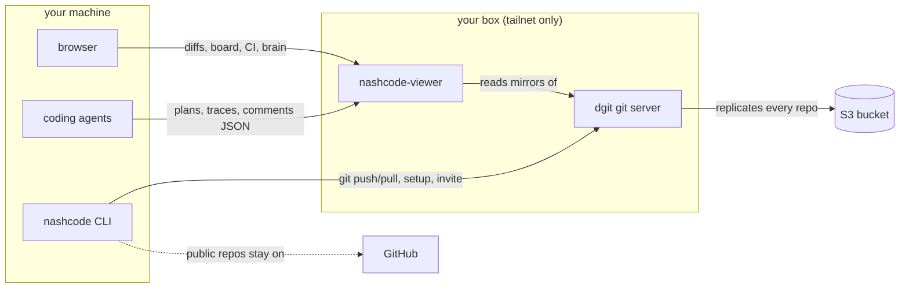
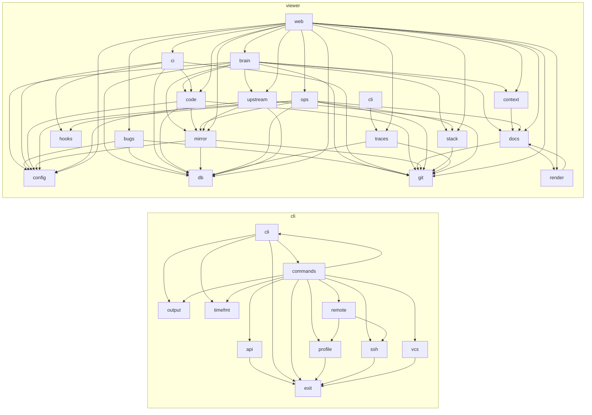

# Architecture

Two diagrams: the system we are building toward, and the module graph as it exists in
this repo right now. The first is edited by hand. The second is regenerated by
`scripts/arch-diagram` (a pre-commit hook keeps it current — enable with
`git config core.hooksPath .githooks`).

## Goal

The system as designed. Edit this by hand when the design changes.

## Reality

Generated — do not edit between the markers. One node per top-level module
(directories collapse to one node), one edge per `crate::` reference.

<!-- arch:begin -->

<!-- arch:end -->
